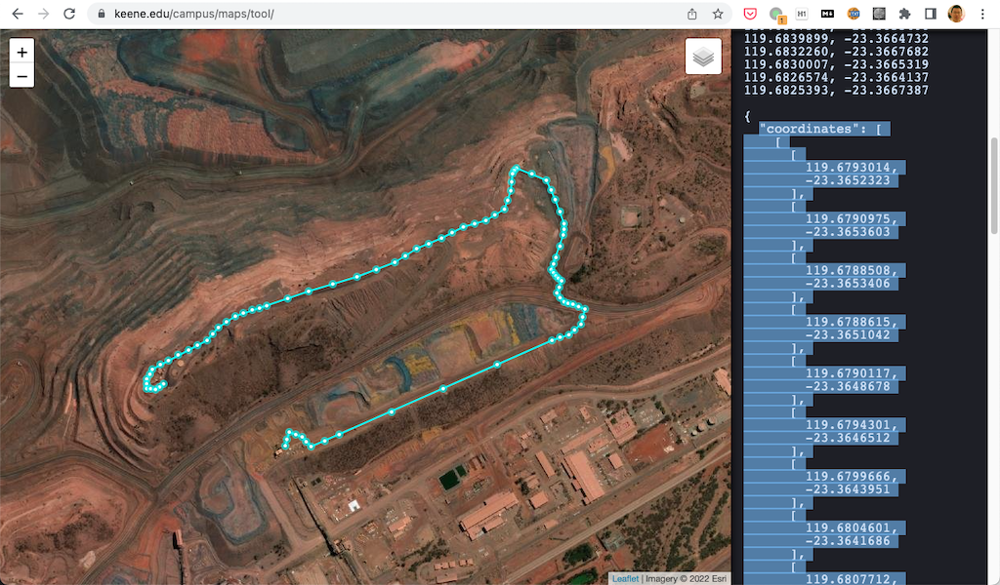

# Connected Vehicle Data Generator

## Introduction

This is project is to generate simulated real-time MQTT message for the [Connected Vehicle Demo](../../../connected-vehicle-web/) project.

## Configuration Guide

You could setup routes in this project, please check the [web](../../../connected-vehicle-web/) project for configurations of icon and picture of vehicles.

File [config.js](./config.js) is where we write the configuration:

```javascript
const appConfig = {
  //"trace","debug","info","warn","error"
  "logLevel": "debug",

  "mqtt": {
    host: "localhost",
    port: 1883,
    clientId: "connected-vehicle-data-generator",
    username: "default",
    password: "default",
  },

  "vehicles": [
    {
      route: "R41",       // must be the id of one route
      type: "HAUL",
      number: 30,
      speed: 50,         // km/hour
      IDPrefix: "HW",    // the id will be from IDPrefix+"001" to IDPrefix+"number"
      reportInterval: 2, // seconds
    },
    {
      route: "R41",
      type: "WATER",
      number: 5,
      speed: 25,
      IDPrefix: "WT",
      reportInterval: 3,
    },

  ],

  "routes": [
    {
      "id": "R41",
      "coordinates": [
        [119.670202,-23.359829],
        [119.6686864,-23.3599466],
        [119.6686864,-23.3599466],
        // .....
      ],
    },
  ],
}

```

- Modify the `mqtt` section to point to the same Solace broker with the *web* project
- `vehicles` is a list of vehicle group objects, for each vehicle group you need specify:
  - `route`: The ID of the route. This data generator will move the vehicles along this route
  - `type`: The *web* porject will show icon and picture of the vehicle based on it's type
  - `number`: How many vehicles will be simulated
  - `speed`: The unit of speed is km/h
  - `IDPrefix`: Each vehicle has a unique ID, start at `IDPrefix`+"001" to `IDPrefix`+"number". Don't use the same `IDPrefix` again in another group
  - `reportInterval`: The data generator will send out a MQTT message of each vehicle in this group on every `reportInterval` seconds.
- `routes` is a list of route object, a route object consists of a unique `id` and a `coordinates`
  - `coordinates` is a list of position, a position is an array of two numbers, this first is longitude the second is latitude, just like the `coordinates` in the [LineString](https://www.rfc-editor.org/rfc/rfc7946#section-3.1.4) of the The GeoJSON Format

## How to run the generator

1. run `npm install` first to install all dependencies
1. run `docker-compose --compatibility up -d` if you wish to start a Solace broker in your local environment
1. run `node app.js` to start the generator

```bash
> node app.js
Init 30 HAUL vehicles on route R41
Init 5 WATER vehicles on route R41
Init 20 HAUL vehicles on route R07
Init 5 WATER vehicles on route R07
Connected, ready to send mqtt messages ...
Start all 60 vehicles
Press Ctrl+C to exit ...
```
 
## Tools to generate routes

You could use [Map Polygon/Polyline Tool](https://www.keene.edu/campus/maps/tool/) to draw a path on the map, then copy the "coordinates" into the config file.

